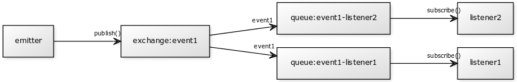

# evque

AMQP-based event bus.

[](https://travis-ci.org/titarenko/evque) [](https://coveralls.io/r/titarenko/evque)

## Installation

```bash
npm i evque --save
```

## Description

Each `event` = `exchange` of `fanout` type, named after event.

Each `subscriber` = `queue` bound to `exchange`, named after event and subscriber.



## Motivation

- simple project bootstrap
- events are preserved across broker restarts
- events will wait for their listeners (will not disappear if listener is offline)

## Example

```js
var bus = require('evque')('amqp://localhost');

bus.on('error', function (ev) {
	console.log(
		'listener %s failed to handle event %s (%j) due to %s',
		ev.listener, ev['event'], ev.data, ev.error.stack
	);
});

bus.on('connection-error', function () {
	console.log('connection closed by RabbitMQ. Restart your app?');
});

bus.subscribe('event1', 'listener1', function (data) {
	console.log('listener1 received event1 (%j)', data);
});

bus.subscribe('event1', 'listener2', function (data) {
	console.log('listener2 received event1 (%j)', data);
});

bus.publish('event1', { a: 'b' });
```

## License

MIT
